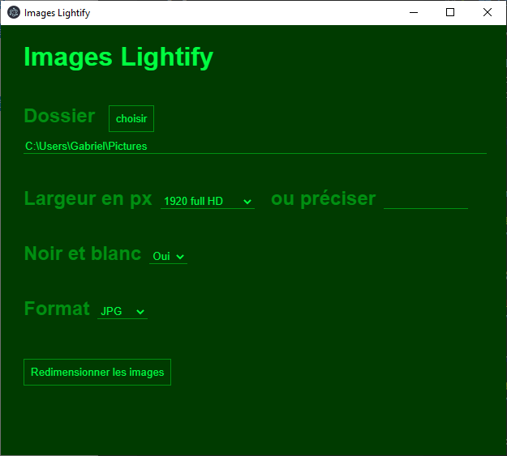

# Resize all pictures in a folder

## For Windows 
1. Download the file [images-lightify-win32-x64.zip](https://www.dropbox.com/sh/mcqcdu0d9w69kxd/AAAIjUxHWDlVjnKj2aXj19Saa?dl=0)
2. unzip it
3. launch images-lightify.exe in the unziped folder

## For Linux and Mac

You will need to install node if you don't have it.

1. clone this repo
2. npm i
3. npm start
